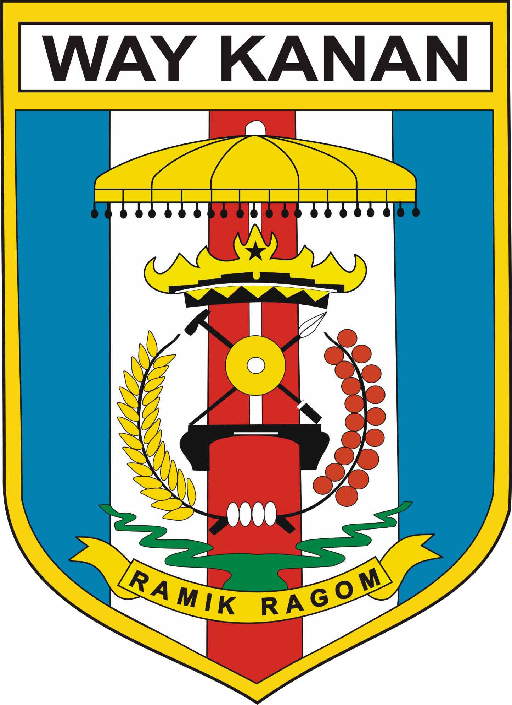

<p align="center">
    
</p>

<h1 align="center">Sistem Informasi E-Arsip</h1>
<p align="center">Dinas Ketahanan Pangan Kabupaten Way Kanan</p>

<p align="center">
    
    
    
    
    
    
</p>

---

## 📋 Daftar Isi

- [Tentang Aplikasi](#tentang-aplikasi)
- [Fitur](#fitur)
- [Teknologi](#teknologi)
- [Persyaratan Sistem](#persyaratan-sistem)
- [Cara Menjalankan (Docker)](#cara-menjalankan-docker)
- [Cara Menjalankan (Local)](#cara-menjalankan-local)
- [Akun Default](#akun-default)
- [Struktur Direktori](#struktur-direktori)
- [API Routes](#api-routes)
- [Troubleshooting](#troubleshooting)
- [Deploy ke Production](#deploy-ke-production)

---

## 🎯 Tentang Aplikasi

**Sistem Informasi E-Arsip** adalah aplikasi berbasis web untuk mengelola arsip digital di lingkungan **Dinas Ketahanan Pangan Kabupaten Way Kanan**. Aplikasi ini mendukung tiga role pengguna:

| Role | Akses |
|------|-------|
| **Admin** | Manajemen penuh: user, bidang, jenis arsip, dan semua arsip |
| **User (Staf)** | Upload & kelola arsip bidang sendiri, export laporan |
| **Pimpinan** | Lihat semua arsip (read-only), export laporan semua bidang |

---

## ✨ Fitur

### Untuk Semua Role
- ✅ Dashboard dengan grafik interaktif (ApexCharts)
- ✅ Dark/Light mode (toggle di navbar)
- ✅ Tampilan glassmorphism responsif
- ✅ Export laporan Excel & PDF
- ✅ Edit password sendiri

### Admin
- 🔧 Kelola User (CRUD)
- 🔧 Kelola Bidang (CRUD)
- 🔧 Kelola Jenis Arsip (CRUD)
- 🔧 Kelola semua arsip (CRUD)

### User (Staf)
- 📄 Upload arsip (PDF/JPG/PNG, maks 5MB)
- 📄 Edit/Hapus arsip bidang sendiri
- 📄 Export laporan bidang sendiri

### Pimpinan
- 👁️ Lihat semua arsip (read-only)
- 👁️ Export laporan semua bidang
- 👁️ Dashboard statistik semua bidang

---

## 🛠️ Teknologi

| Komponen | Teknologi | Versi |
|----------|-----------|-------|
| Backend | Laravel | 13.6.0 |
| PHP | PHP | 8.5 |
| Frontend | Blade + Tailwind CSS | 4.2.4 |
| Database | MySQL | 8.0 |
| App Server | FrankenPHP + Octane | 2.17 |
| Cache/Session | Redis | 7 |
| Charts | ApexCharts | - |
| Export Excel | Maatwebsite Excel | 3.1 |
| Export PDF | DomPDF | 3.1 |
| Testing | Pest PHP | 4.6 |

---

## 📦 Persyaratan Sistem

### Docker (direkomendasikan)
- [Docker](https://docs.docker.com/get-docker/) 24+
- [Docker Compose](https://docs.docker.com/compose/install/) 2.20+
- RAM minimal 2GB

### Local (tanpa Docker)
- PHP 8.3+ (ekstensi: `pdo_mysql`, `mbstring`, `gd`, `zip`, `bcmath`, `intl`)
- Composer 2
- Node.js 20+ & npm
- MySQL 8.0+ / MariaDB
- Redis 7+ (opsional)

---

## 🐳 Cara Menjalankan (Docker)

### 1. Clone Project

```bash
cd /path/to/project
```

### 2. Setup Environment

```bash
cp .env.docker .env
```

### 3. Build & Jalankan

```bash
docker compose up -d --build
```

### 4. Generate Key & Setup Database

```bash
docker compose exec app php artisan key:generate
docker compose exec app php artisan migrate --seed --force
docker compose exec app php artisan storage:link --force
```

### 5. Akses Aplikasi

Buka **http://localhost** 🎉

### Perintah Cepat (Makefile)

```bash
make up          # Start container
make down        # Stop container
make shell       # Masuk container
make migrate     # Migrasi database
make seed        # Seed data contoh
make test        # Jalankan tests
make logs        # Lihat logs
make help        # Semua perintah
```

---

## 💻 Cara Menjalankan (Local)

### 1. Install Dependencies

```bash
composer install
npm install
```

### 2. Setup Environment

```bash
cp .env.example .env
php artisan key:generate
```

> Edit `.env`: sesuaikan `DB_DATABASE`, `DB_USERNAME`, `DB_PASSWORD`

### 3. Buat Database

```bash
mysql -u root -p -e "CREATE DATABASE arsip_arif CHARACTER SET utf8mb4 COLLATE utf8mb4_unicode_ci;"
```

### 4. Migrasi & Seed

```bash
php artisan migrate --seed
php artisan storage:link
npm run build
```

### 5. Jalankan

```bash
php artisan serve
# atau dengan hot reload:
composer run dev
```

Akses: **http://localhost:8000** 🎉

---

## 🔐 Akun Default

| Username | Password | Role | Bidang |
|----------|----------|------|--------|
| `admin` | `password` | **Admin** | - |
| `kepala.dinas` | `password` | **Pimpinan** | Sekretariat |
| `staff.sekretariat` | `password` | **User** | Sekretariat |
| `staff.ketersediaan` | `password` | **User** | Bidang Ketersediaan Pangan |
| `staff.distribusi` | `password` | **User** | Bidang Distribusi Pangan |
| `staff.konsumsi` | `password` | **User** | Bidang Konsumsi Pangan |

### Data Contoh

**Bidang:** Sekretariat, Bidang Ketersediaan Pangan, Bidang Distribusi Pangan, Bidang Konsumsi Pangan

**Jenis Arsip:** Surat Keputusan (SK), Nota Dinas, Surat Masuk, Surat Keluar, Laporan, Instruksi Kerja

---

## 📁 Struktur Direktori

```
📁 arsip_arif/
├── Dockerfile                    # Image FrankenPHP + Octane
├── docker-compose.yml            # 3 services (app, database, cache)
├── Makefile                      # Perintah Docker
├── INSTALL.md                    # Panduan instalasi detail
├── .env.docker                   # Env untuk Docker
├── .env.example                  # Contoh env
│
├── app/
│   ├── Exports/
│   │   └── ArsipExport.php       # Export Excel
│   ├── Http/
│   │   ├── Controllers/
│   │   │   ├── Auth/LoginController.php
│   │   │   ├── DashboardController.php
│   │   │   ├── ArsipController.php
│   │   │   ├── UserController.php
│   │   │   ├── BidangController.php
│   │   │   ├── JenisArsipController.php
│   │   │   └── ProfileController.php
│   │   └── Middleware/
│   │       ├── AdminMiddleware.php
│   │       ├── UserMiddleware.php
│   │       └── PimpinanMiddleware.php
│   ├── Models/
│   │   ├── User.php
│   │   ├── Bidang.php
│   │   ├── JenisArsip.php
│   │   └── Arsip.php
│
├── resources/
│   ├── css/app.css               # Glassmorphism + dark/light mode
│   ├── js/app.js                 # ApexCharts + Theme Switcher
│   └── views/
│       ├── layouts/
│       ├── components/
│       ├── auth/login.blade.php
│       ├── dashboard/index.blade.php
│       ├── arsip/
│       ├── users/
│       ├── bidang/
│       ├── jenis-arsip/
│       └── profile/
│
├── routes/
│   └── web.php                   # 36 routes dengan middleware
│
├── tests/
│   └── Feature/
│       └── ExampleTest.php       # 22 test cases
│
└── database/
    ├── migrations/               # 7 migration files
    ├── factories/                # 4 factory files
    └── seeders/                  # 4 seeder files
```

---

## 🔌 API Routes

| Method | URI | Middleware | Fungsi |
|--------|-----|-----------|--------|
| GET | `/login` | guest | Halaman login |
| POST | `/login` | guest | Proses login |
| POST | `/logout` | auth | Logout |
| GET | `/dashboard` | auth | Dashboard dengan grafik |
| GET | `/arsip` | auth | Daftar arsip (filter per role) |
| POST | `/arsip` | auth | Upload arsip baru |
| GET | `/arsip/{id}/edit` | auth | Form edit arsip |
| PUT | `/arsip/{id}` | auth | Update arsip |
| DELETE | `/arsip/{id}` | auth | Hapus arsip |
| GET | `/arsip/export/excel` | auth | Export Excel |
| GET | `/arsip/export/pdf` | auth | Export PDF |
| GET | `/profile` | auth | Edit profil |
| PUT | `/profile/password` | auth | Ubah password |
| GET | `/admin/users` | admin | Kelola user |
| GET | `/admin/bidang` | admin | Kelola bidang |
| GET | `/admin/jenis-arsip` | admin | Kelola jenis arsip |

---

## 🐛 Troubleshooting

### Container tidak bisa start

```bash
# Cek logs
docker compose logs

# Ganti port jika bentrok (di .env)
# APP_PORT=8080
# DB_PORT_MAP=3307
# REDIS_PORT_MAP=6380
```

### Database connection refused

```bash
# Cek kesehatan database
docker compose exec database mysqladmin ping -u root -proot_secret

# Jalankan migrasi ulang
make migrate
```

### Storage link error

```bash
rm -rf public/storage
docker compose exec app php artisan storage:link --force
```

### 502 Bad Gateway / Octane error

```bash
make octane-reload
# atau
docker compose restart app
```

### Reset total (semua data hilang)

```bash
docker compose down -v
docker compose up -d --build
docker compose exec app php artisan key:generate
docker compose exec app php artisan migrate --seed --force
docker compose exec app php artisan storage:link --force
```

---

## 🚀 Deploy ke Production

### Docker Production

```bash
# 1. Set environment
cp .env.docker .env
#   - APP_ENV=production
#   - APP_DEBUG=false
#   - OCTANE_HTTPS=true

# 2. Build production image
docker compose build --no-cache

# 3. Start
docker compose up -d

# 4. Optimasi Laravel
make optimize

# 5. Setup HTTPS (letakkan sertifikat di volume caddy)
```

### Shared Hosting

1. Upload semua file ke hosting
2. Set document root ke `/public`
3. Konfigurasi database di `.env`
4. Jalankan:
   ```bash
   composer install --no-dev --optimize-autoloader
   php artisan key:generate
   php artisan migrate --seed --force
   php artisan storage:link
   php artisan optimize
   ```

---

## 📝 Lisensi

Aplikasi ini dikembangkan untuk **Dinas Ketahanan Pangan Kabupaten Way Kanan**.

---

<p align="center">
    <sub>Dibangun dengan ❤️ menggunakan Laravel, FrankenPHP, dan Tailwind CSS</sub>
    <br>
    <sub>© 2026 Dinas Ketahanan Pangan Kabupaten Way Kanan</sub>
</p>
